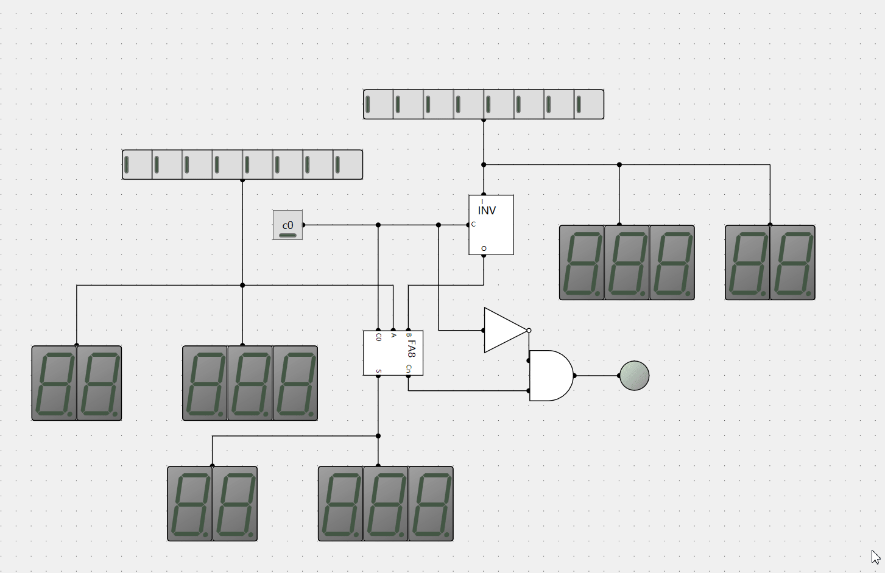

# 8bitcpu
a simple 8bit cpu with logic-circuit


### 加法/减法电路




| A    | B    | S    | C    |
| ---- | ---- | ---- | ---- |
| 0    | 0    | 0    | 0    |
| 0    | 1    | 1    | 0    |
| 1    | 0    | 1    | 0    |
| 1    | 1    | 0    | 1    |


$$
\begin{aligned}
S= & \overline{A}B + A\overline{B} \\
C =  & AB
\end{aligned}
$$


### 取反

|I|C|O|
|-|-|-|
|0|1|1|
|0|0|0|
|1|0|1|
|1|1|0|

$$
\begin{aligned}
O =&I\overline{C} + \overline{I}C \\
\end{aligned}
$$

### 按位取反
```
8
00001000

-8 
11110111 反码
11111000 补码


```


### 减法输出真值表
|C0|Cn|O|
|-|-|-|
|0|0|0|
|0|1|1|
|1|0|0|
|1|1|0|

$$
\begin{aligned}
    O = \overline{C0}Cn 
\end{aligned}
$$

### R-S触发器真值表
|R|S|Q|Q'|
|-|-|-|-|
|0|0|Q|Q'|
|0|1|1|0|
|1|0|0|1|
|1|1|0|0|


### D触发器真值表
|En|S|Q|
|-|-|-|
|0|0|0|
|0|1|0|
|1|0|0|
|1|1|1|

### D边沿触发器真值表
|En|S|Q|
|-|-|-|
|0|0|0|
|0|1|0|
|1|1|1|
|1|0|1|

```
set data then open En -> On
reset data then reset En then open En -> Off

```